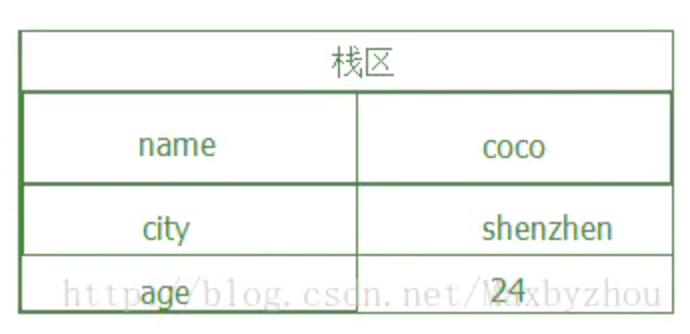
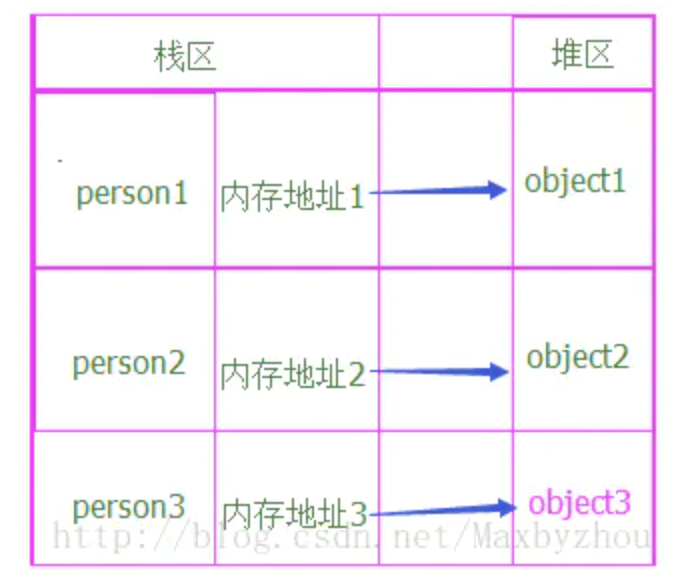

# 引用类型、值类型

## 值类型

`number`、`undefined`、`null`、`symbol`、`string(赋值传递中会以引用类型方式处理)`、`boolean`



## 引用类型

`对象`、`数组`、`函数`



``` js
let a = {}
let b = {}
a == b // false
```

引用类型的值是指向堆，a,b两个变量指向的是不同的两个堆

# typeof 

typeof 只能判断`值类型`、`引用类型(object)`、`函数`

# 深拷贝

``` js
function deepClone(obj = {}) {
    if (typeof obj !== "object" || obj == null) {
        return obj;
    }

    let result;

    if (obj instanceof Array) {
        result = [];
    } else {
        result = {};
    }

    for (let key in obj) {
        if (obj.hasOwnProperty(key)) {
            result[key] = deepClone(obj[key]);
        }
    }

    return result;
}
```

**`JSON.parse(JSON.stringify(obj))`深拷贝，函数会丢失**