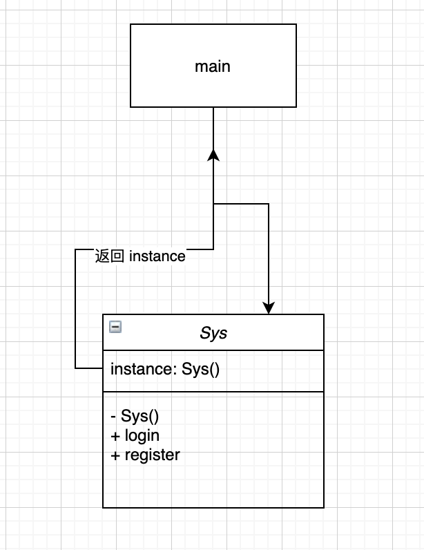

# uml 类图



# 介绍

* 项目中只有一个
* 一个对象只能有一个实例

# demo

``` js
class Sys {
    login() {
        console.log("登录");
    }

    register() {
        console.log("注册");
    }
}

const getSys = (function() {
    let instance;

    return function() {
        if (!instance) {
            instance = new Sys();
        }

        return instance;
    };
})();

const s1 = getSys();
const s2 = getSys();
console.log(s1 === s2); // true

const s3 = new Sys();
console.log(s1 === s3); // false

// 解决 在调用时使用 new Sys() 产生不同实例
// 使用模块化时，只导出 getSys方法
// export default getSys;
```

# 疑问

::: tip 在调用时使用 new Sys() 产生不同实例，如何解决？
使用模块化时，只导出 getSys方法 (export default getSys)
:::