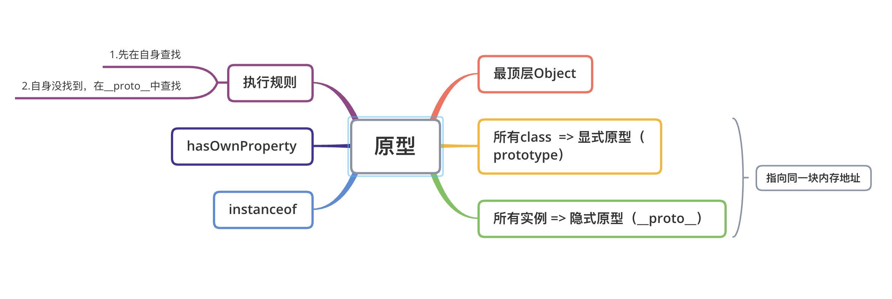

``` js 
class Person {
    constructor(name, age) {
        this.name = name;
        this.age = age;
    }

    speak() {
        console.log(`我的名字：${this.name}, 今年：${this.age}`);
    }
}

class Student extends Person {
    constructor(name, age, num) {
        super(name, age);

        this.num = num;
    }

    speakNum() {
        console.log(`学号：${this.num}`);
    }
}

const p = new Person("jack", 20);
p.speak();

const stu1 = new Student("lisa", 19, 10001);
console.log(Student.prototype === stu1.__proto__); // true 指向同一块内存地址 引用类型
console.log(stu1);
stu1.speak();
stu1.speakNum();

for (let prop in stu1) {
    console.log(`stu1.${prop}: ${stu1.hasOwnProperty(prop)}`);
}

console.log(stu1 instanceof Student); // true
console.log(stu1 instanceof Person); // true
console.log(stu1 instanceof Object); // true 所有对象都是Object构造的
```

* `instanceof` 检测构造函数的prototype属性是否出现在某个实例的原型链上
* `hasOwnProperty` 对象的属性中是否具有指定属性（是否是对象的自身属性）