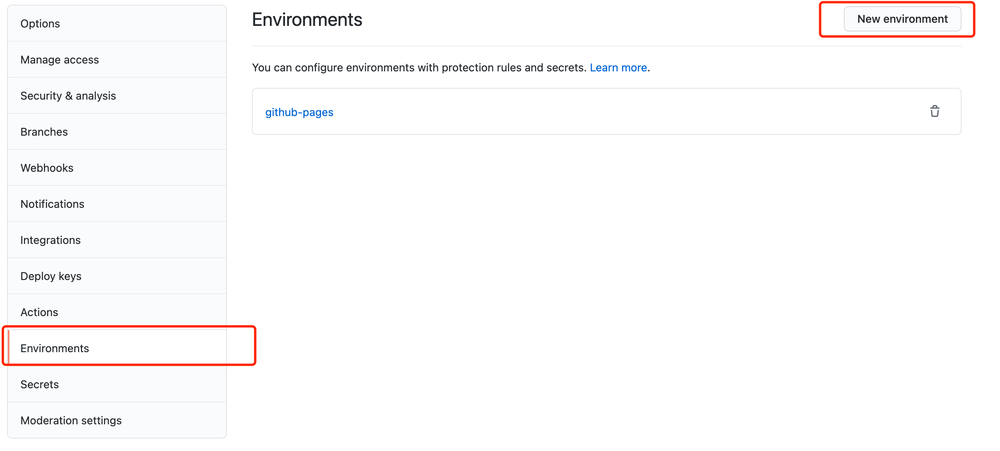
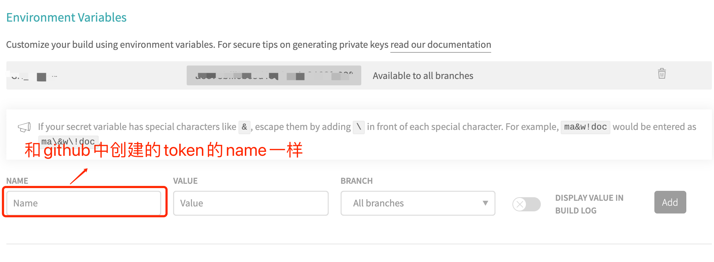
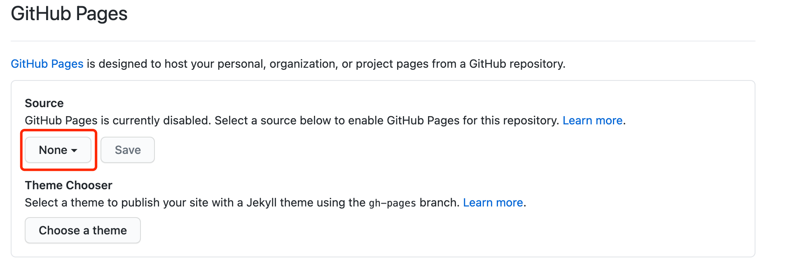

# 本地配置vuepress

在本地安装vuepress，并在根目录创建 `.travis.yml`, `deploy.sh`

::: details .travis.yml
``` yml
language: node_js
node_js:
  - lts/*
install:
  - yarn install # 安装依赖
script:
  - yarn build # 执行build命令
deploy:
  provider: pages
  skip_cleanup: true
  local_dir: notes/.vuepress/dist  # vuepress打包之后的目录
  github_token: $GH_TOKEN # github, travis配置的token
  keep_history: true
  on:
    branch: master
```
:::

::: details deploy.sh
``` sh
#!/usr/bin/env sh

# 确保脚本抛出遇到的错误
set -e

# 生成静态文件
npm run build

# 进入生成的文件夹
cd notes/.vuepress/dist

# 如果是发布到自定义域名
# echo 'www.example.com' > CNAME

git init
git add -A
git commit -m 'deploy'

# 如果发布到 https://<USERNAME>.github.io
git push -f git@github.com:meetqy/meetqy.github.io.git master

# 如果发布到 https://<USERNAME>.github.io/<REPO>
# git push -f git@github.com:<USERNAME>/<REPO>.git master:gh-pages

cd -
```
:::

# github中创建token



[创建token](https://github.com/meetqy/meetqy.github.io/settings/environments/new)，name为`GH_TOKEN`。

# travis关联github仓库

在[travis](https://www.travis-ci.com/)中注册，并找到想要关联的仓库。点击右侧`more options` > `settings` 配置token



# 最后

将代码提交到github仓库中，travis-ci的日志中可以看到执行进度，以及报错等信息。

# 总结

1. github中创建token时的`name`一定要和`travis-ci`,`.travis.yml`中的name保持一致，不然会报401
2. github page中选择Branch(分支)的时候，要选择travis-ci提交的那个分支。默认是：gh-pages
